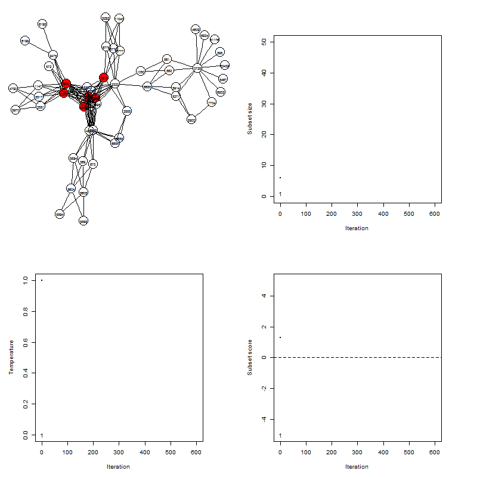

# signet: Selection Inference in Gene Networks

`signet` is a R package for the evolutionary analysis of gene networks.

On the basis of a biological pathways database, and a gene scores list, 
one could search for high-scoring subnetworks and test their significance in pathways.

The method implemented is based on Ideker et al. (2002) heuristic, 
but several improvements are considered.

## Installation

There is no official release of the signet package at the moment. 
But you can install the development version using the `devtools` package 
(Rtools must also be installed and properly configured):

```
#install.packages('devtools')
devtools::install_github('algorythmes/signet')
```

## Methodology

Here is an animation representing a run of the simulated annealing 
algorithm used in the package:



You can learn more about the methodology here:

[methodo](misc/methodo.md)


## Application

Data: we will use KEGG Pathways data, and genetic data from Daub et al. (2013), 
consisting in corrected Fst computed over 53 human populaions, 
for more than 17,000 genes.

```
data(keggPathways);data(zScores)
```

First, we generate the null distribution of the subnetworks scores 
for subnetworks of size kmin to kmax. 
This may be a little long, so you can use `data(nullDistExample)` instead.

```
nullDistribution(keggPathways,zScores,iterations = 10000)
```
Then, we apply the simulated annealing algorithm 
on pathways of your choice. Pathways must be in the `graphNEL` format. 
You can provide the `searchSubnet()` function a graph list, or a single graph.

```
searchSubnet(keggPathways[[1]],zScores,iterations = 10000)
```

