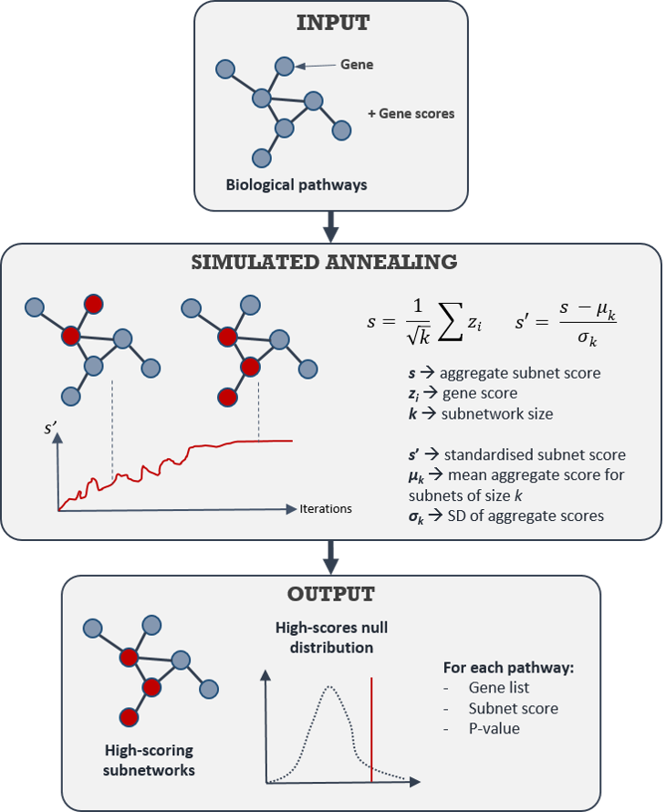
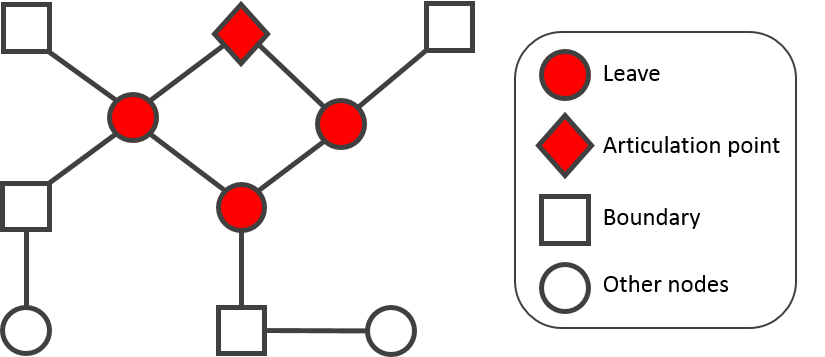

---
output:
  html_document: default
  word_document:
    highlight: tango
---
# signet: Selection Inference in Gene NETworks

## Introduction

Understanding forces shaping patterns of genetic diversity is a central focus
in population genetics. The development of theoretical models allowed us to
have some expectations concerning the impact of various neutral or adaptive 
forces in the genome. These expectations permitted to develop methods of 
detection of the footprints of selection in the genome. A large number of these 
methods are based on a measure of genetic differentiation between populations,
FST. Indeed, they aim at detecting loci showing a higher differentiation than
expected under a neutral model; possibly due to positive selection.

But Pritchard and Di Rienzo (2010) argued that many adaptive events in 
natural populations occur by the evolution of polygenic traits, rather than 
via the fixation of single beneficial mutations. Recent studies in various model
organisms have indeed confirmed that variation at many important 
traits is controlled by a large number of loci dispersed throughout the genome
(Yang et al. 2010; Stranger et al. 2011; Atwell et al. 2010; 
Jumbo-Lucioni et al. 2010). Polygenic adaptation typically involves small 
allele frequency changes at many loci (Mackay et al. 2009), which may remain 
below the detection limit of most outlier detection methods 
(Le Corre and Kremer 2012). Then, FST outlier tests are seriously 
challenged by selection acting on many small-effect loci.

In this context, we developed a method to detect polygenic adaptation in the
genome. We consider the information given by the network information as 
a prior concerning the target of polygenic selection. Indeed, it is more likely
that genes together under selection are found in the same biological network
because they are all related to the same phenotype.

We will call gene network every type of data involving interactions
between genes or proteins. For example, it can be a gene regulatory network, 
a biological pathway, or a protein-protein interactions dataset.

The methodology implemented in the `signet` package presented here is an 
extension of genome scans for selection to gene networks. Using a statistic to 
measure selection, the idea is to find in gene networks high scoring subgroups 
of genes.

## Workflow

### General principle

The general idea is simple: we have a gene list with prealably defined scores 
(e.g. a differentiation measure like the Fst) and we want to find gene networks
yielding a highest score than expected under a null hypothesis.

To do so, we will use an interaction database (e.g. biological pathways) and
search in these data for high-scoring subnetworks. Then, 

<p align="center"></p>
<p align="center">Figure 1: Workflow.</p>

### Input preparation

#### Biological networks conversion to graphs

In order to get information about relationships between genes,
we advise to use the Bioconductor package `graphite`, which implements a 
procedure to convert biological pathways data from different databases to 
graphs (for more details, see Sales et al., 2012). These databases have emerged 
as references in systems biology: KEGG, Reactome, BioCarta, NCI, Panther 
and HumanCyc.

#### Correction for overlapping between pathways

We will first exclude all pathways completely included in at least another 
pathway (overlap = 1). I still need to implement a procedure to merge pathways 
with an overlapping level greater than a given threshold.

Finally, pathways with no connected component of size greater than 10 
(arbitratry threshold) are removed.

### Search algorithm

The method implemented is based on Ideker et al. (2002) heuristics, 
but several improvements are considered. You can see below an animation 
representing a run of the simulated annealing algorithm used in the package.

<p align="center"></p>
<p align="center">Figure 2: Simulated annealing run in a gene network.</p>

As you can see, as we add or remove new genes in the active subnetwork (in red),
the score is maximized as we iterate.

#### Background distribution

To apply the algorithm to a list of pathways, you have to first generate the 
background distribution of your summary statistic.

The input is the list of all the pathways you want to analyze, and a list of 
scores for each gene. The background distribution or the statistic will be 
generated for each possible subnetwork size (kmin to kmax).

A pathway is randomly sampled (the sampling probability being conditioned by 
the number of genes in the pathway) and a connected subnetwork of size k is 
randomly picked (one gene is sampled in the pathway, then k genes in the 
boundary). The score of the subnetwork is then computed. Here, the score is 
simply the average Fst over all genes in the subnetwork.

This is done N times for each k, to get the background distribution of 
subnetworks scores, we just keep the mean and standard error of this 
distribution.

#### Algorithm for high-scoring subnetwork search

We consider that genes can yield two states: active or inactive.

1. Generate a random solution, i.e. pick a random subnetwork of arbitrary size k
in the gene network.

2. Calculate its score using a scoring function. Here, the 
score s is the average FST, standardized by the background distribution for
a network of size k.

3. Generate a random neighboring solution, i.e. a new subnetwork.
To do so, we randomly pick a new gene and toggle its state (i.e. we activate
or inactivate it). The selected gene is not an articulation point of 
the subgraph, i.e. its removal doesn’t disconnect the active subgraph. The 
selected gene is randomly picked from the following nodes: i) nodes in 
the boundary; ii) leaves, iii) nodes which are not articulation points of 
the subgraph.

<p align="center"></p>
<p align="center">Figure 3: Schematic representation of a network.</p>

4. Calculate the new subnetwork's score

5. Compare them:
If snew < sold: move to the new solution
If snew > sold: maybe move to the new solution (acceptance probability)

6. Repeat steps 3-5 above until an acceptable solution is found or you reach 
some maximum number of iterations.

### Testing the significance of the subnetworks scores

As the high-scoring search procedure tends to bias the p-values distribution 
towards low values, the test will be non-conservative if we use the background 
distribution to compute the significance of the subnetwork score. Therefore, 
the test implemented uses this high-scoring search procedure. For N iterations, 
gene scores are permuted. Then, a pathway is randomly sampled (the sampling 
probability being conditioned by the number of genes in the pathways) and 
the search algorithm is applied to this pathway. The score of the high-scoring 
subnetwork found in the randomized data is computed and its distribution is
generated. This is the null distribution of the test.

### Correct for subnetwork overlapping and multiple testing

Subnetwork overlapping. Corresponds to Jaccard index.
Arbitrary threshold (e.g. define clusters of pathways having at least 30% 
of genes in common). Then, you can decide for each cluster either to
keep the most significant subnetwork in the cluster, or to merge all the 
subnetworks.

Finally, a correction for multiple testing is highly recommended as you usually
apply this test to hundreds of pathways. We advise to use the FDR 
method of Storey (2002) implemented in the R package `qvalue`. This correction 
must be done after taking into account of overlapping as it would lead to
correlated p-values (not recommended for most methods of correction for 
multiple testing).

### Output

The output is, for each pathway tested, the subnetwork, its score and its 
significance.

Need to characterize the function of this subnetwork, which is not necessarily 
limited to the pathway function. For example, how can we interpret a subnetwork 
of 10 genes inside a 1000 genes pathway? 
You have to be careful when 
interpreting the name of the pathway as a significant function beacause 
a part only of this pathway is significant.


## A walkthrough example

### Installation

There is no official release of the `signet` package at the moment. 
But you can install the development version on GitHub using the `devtools` 
package (`Rtools` must also be installed and properly configured):

```r
#install.packages('devtools')
devtools::install_github('CMPG/signet')
```

### Data

We will use KEGG Pathways data, and genetic data from Daub et al. (2013), 
consisting in corrected FST (zST) computed over 53 human populations, 
for more than 17,000 genes.

```r
data(keggPathways);data(zScores)
```

### Analysis

First, we generate the background distribution of the subnetworks scores 
for subnetworks of size f from 1 to 200 (the size of the biggest KEGG pathway). 
This may be a little long, so you can use `data(backgroundDist)` instead.

```r
backgroundDist(keggPathways,zScores,iterations = 5000)
```
Then, we apply the simulated annealing algorithm 
on pathways of your choice. Pathways must be in the `graphNEL` format. 
You can provide the `searchSubnet()` function a graph list, or a single graph.

```r
signetObject <- searchSubnet(pathways = keggPathways[[1]],
                             score = zScores,
                             null = backgroundDist,
                             iterations = 5000,
                             temperature = 0.995)
```

This function returns a list of N elements (corresponding to N pathways),
including a table with the whole list of genes, their scores, 
and a boolean indicating if they are found in the high-scoring subnetwork.

```r
testSubnet(signetObject,
           cluster = "max",
           multipleTesting = TRUE,
           threshold = 0.05)
```

The subnetwork score and the p-value are also included.

Then, you can make a correction for overlapping and multiple testing.

```r
results <- correctSubnet(signetObject,
                         cluster = "max",
                         multipleTesting = TRUE,
                         threshold = 0.05)
```
This will return only the subnetworks resisting to overlapping and/or 
multiple testing correction.

You can then write the results in a file in your working directory.

```r
writeResults(results)
```

## References

Daub, J. T., Hofer, T., Cutivet, E., Dupanloup, I., Quintana-Murci, L., 
Robinson-Rechavi, M., & Excoffier, L. (2013). Evidence for polygenic 
adaptation to pathogens in the human genome. Molecular biology and evolution, 
30 (7): 1544-1558.

Ideker, T., Ozier, O., Schwikowski, B., & Siegel, A. F. (2002). 
Discovering regulatory and signalling circuits in molecular interaction 
networks. Bioinformatics, 18(suppl 1), S233-S240.

Le Corre, V., and A. Kremer (2012). The genetic differentiation at quantitative 
trait loci under local adaptation. Molecular Ecology 21:1548–1566.

Mackay, T. F., Stone, E. A., & Ayroles, J. F. (2009). 
The genetics of quantitative traits: challenges and prospects. 
Nature Reviews Genetics, 10(8), 565-577.

Pritchard, J. K., & Di Rienzo, A. (2010). Adaptation–not by sweeps alone. 
Nature Reviews Genetics, 11(10), 665-667.

Sales, G., Calura, E., Cavalieri, D., & Romualdi, C. (2012). 
graphite-a Bioconductor package to convert pathway topology to gene network. 
BMC bioinformatics, 13(1), 20.

Stephan, W. (2016). Signatures of positive selection: from selective sweeps 
at individual loci to subtle allele frequency changes in polygenic adaptation. 
Molecular ecology, 25(1), 79-88.

Storey JD. (2002) A direct approach to false discovery rates. 
Journal of the Royal Statistical Society, Series B, 64: 479-498.

Wollstein, A., & Stephan, W. (2015). Inferring positive selection in humans 
from genomic data. Investigative genetics, 6(1), 5.
